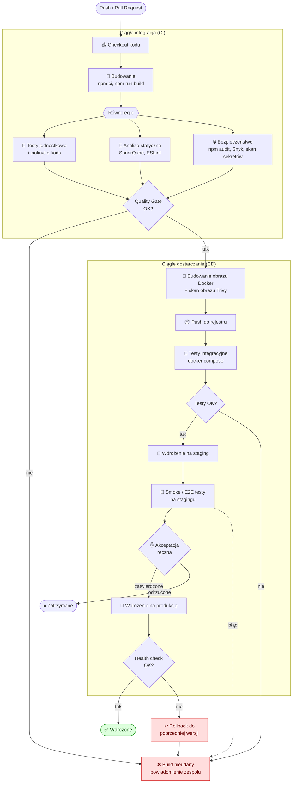

# Pipeline CI/CD w Jenkinsie – aplikacja webowa

```mermaid
flowchart TD
    START([Push / Pull Request]) --> CHECKOUT

    subgraph CI["Ciągła integracja (CI)"]
        CHECKOUT[📥 Checkout kodu] --> BUILD[🔨 Budowanie<br/>npm ci, npm run build]
        BUILD --> PAR{{Równolegle}}
        PAR --> UNIT[🧪 Testy jednostkowe<br/>+ pokrycie kodu]
        PAR --> SAST[🔎 Analiza statyczna<br/>SonarQube, ESLint]
        PAR --> SEC[🔒 Bezpieczeństwo<br/>npm audit, Snyk, skan sekretów]
        UNIT --> QG{Quality Gate<br/>OK?}
        SAST --> QG
        SEC --> QG
    end

    QG -- nie --> FAIL[❌ Build nieudany<br/>powiadomienie zespołu]
    QG -- tak --> DOCKER

    subgraph CD["Ciągłe dostarczanie (CD)"]
        DOCKER[🐳 Budowanie obrazu Docker<br/>+ skan obrazu Trivy] --> PUSH[📦 Push do rejestru]
        PUSH --> INT[🔗 Testy integracyjne<br/>docker compose]
        INT --> INTOK{Testy OK?}
        INTOK -- tak --> STAGING[🚧 Wdrożenie na staging]
        STAGING --> SMOKE[💨 Smoke / E2E testy<br/>na stagingu]
        SMOKE --> APPROVE{✋ Akceptacja<br/>ręczna}
        APPROVE -- zatwierdzone --> PROD[🚀 Wdrożenie na produkcję]
        PROD --> HEALTH{Health check<br/>OK?}
    end

    INTOK -- nie --> FAIL
    SMOKE -. błąd .-> FAIL
    APPROVE -- odrzucone --> STOP([⏹ Zatrzymane])
    HEALTH -- tak --> DONE([✅ Wdrożone])
    HEALTH -- nie --> ROLLBACK[↩️ Rollback do<br/>poprzedniej wersji]
    ROLLBACK --> FAIL

    classDef fail fill:#fdd,stroke:#c00,color:#600;
    classDef ok fill:#dfd,stroke:#080,color:#040;
    class FAIL,ROLLBACK fail;
    class DONE ok;
```
